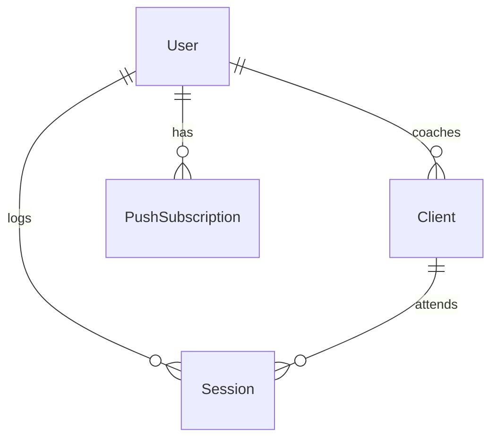

# Coach Gym Session Logger App

## Overview

A Progressive Web App (PWA) for personal trainers to manage their client roster and track training sessions. Coaches log which clients they trained each day, the app keeps session counts accurate, fires low-package alerts, delivers daily logging reminders, and produces a downloadable monthly summary. All AI features run through Groq's free tier using **Llama 3.3 70B** for natural-language session parsing and summary generation.

---

## Problem Statement

Personal trainers currently track client sessions in spreadsheets or notebook apps. This creates friction:
- No automatic session-count deduction when a session is logged
- No proactive alert when a client's package is nearly exhausted
- No daily reminder to log — sessions go unrecorded
- Manual effort to produce end-of-month summaries for billing or review

---

## Proposed Solution

A mobile-first PWA with:
- A **quick-log flow** powered by Llama 3.3 70B: the coach types "trained John and Amara today" and the AI identifies clients, updates their session counts, and confirms
- **Client roster management** with manual entry and CSV/Excel bulk import
- **Web Push notifications** for daily reminders and low-session alerts
- **Monthly reports** with a full breakdown and one-click CSV download

---

## Tech Stack

| Layer | Choice | Rationale |
|---|---|---|
| Framework | Next.js 14 (App Router) | App Router + Server Actions simplify API layer |
| Language | TypeScript | Type safety across data models |
| Styling | Tailwind CSS | Fast, mobile-first utility classes |
| PWA | `@serwist/next` + `serwist` | The maintained successor to next-pwa; App Router support |
| Database | Prisma + SQLite (dev) → PostgreSQL (prod) | One-line provider swap; zero infra for dev |
| Auth | NextAuth.js v4 | Email + OAuth; session cookies |
| AI / NLP | `groq-sdk` → `llama-3.3-70b-versatile` | Free tier; 500k tokens/day; best structured extraction |
| AI (reminders) | `groq-sdk` → `llama-3.1-8b-instant` | Faster + cheaper for short reminder copy |
| Push notifications | `web-push` (VAPID) | Standards-compliant; works on all PWA-capable browsers |
| CSV/Excel import | `papaparse` + `xlsx` (SheetJS) | In-browser parsing; no server upload needed |
| CSV export | `papaparse` (unparse) | Same library, zero extra deps |
| Offline queue | `idb` | Typed IndexedDB wrapper for offline session logging |
| Cron jobs | Vercel Crons (vercel.json) | Free; no extra infra; easy to configure |
| Deployment | Vercel | Free tier; native cron support |
| Animation | `framer-motion` | Spring physics, layout animations, AnimatePresence |
| Confetti | `canvas-confetti` | Lightweight; 30-particle burst on session confirm |

---

## Data Models (Prisma Schema)

```prisma
// prisma/schema.prisma

datasource db {
  provider = "sqlite"      // change to "postgresql" for Supabase/Vercel Postgres
  url      = env("DATABASE_URL")
}

generator client {
  provider = "prisma-client-js"
}

model User {
  id                String             @id @default(cuid())
  email             String             @unique
  name              String?
  reminderTime      String?            // "HH:MM" in 24h, e.g. "08:00"
  reminderEnabled   Boolean            @default(true)
  clients           Client[]
  sessions          Session[]
  pushSubscriptions PushSubscription[]
  createdAt         DateTime           @default(now())
}

model Client {
  id                     String    @id @default(cuid())
  name                   String
  phone                  String?
  totalSessionsPurchased Int       @default(0)
  sessionsRemaining      Int       @default(0)
  unpaidSessions         Int       @default(0)  // only valid when sessionsRemaining = 0
  active                 Boolean   @default(true)
  coachId                String
  coach                  User      @relation(fields: [coachId], references: [id], onDelete: Cascade)
  sessions               Session[]
  createdAt              DateTime  @default(now())
  updatedAt              DateTime  @updatedAt
}

model Session {
  id        String   @id @default(cuid())
  date      DateTime @default(now())
  notes     String?
  rawInput  String?  // original natural language text
  clientId  String
  client    Client   @relation(fields: [clientId], references: [id], onDelete: Cascade)
  coachId   String
  coach     User     @relation(fields: [coachId], references: [id], onDelete: Cascade)
  createdAt DateTime @default(now())
}

model PushSubscription {
  id        String   @id @default(cuid())
  endpoint  String   @unique
  keys      String   // JSON string: { p256dh, auth }
  userId    String
  user      User     @relation(fields: [userId], references: [id], onDelete: Cascade)
  createdAt DateTime @default(now())
}
```

**ERD:**



---

## App Pages & Routes

| Route | Page | Description |
|---|---|---|
| `/` | Dashboard | Today's session log, recent activity, low-package alerts |
| `/onboarding` | Onboarding | First-run setup: reminder time, push permission |
| `/clients` | Client Roster | List all clients with session counts |
| `/clients/new` | Add Client | Manual single-client form |
| `/clients/import` | Bulk Import | CSV/Excel drag-and-drop uploader |
| `/clients/[id]` | Client Detail | Session history + edit package |
| `/sessions/new` | Quick Log | AI-powered quick session log |
| `/reports` | Monthly Reports | Summary + breakdown table + CSV download |
| `/settings` | Settings | Reminder time, push toggle, account |
| `/api/push/subscribe` | API | Save push subscription |
| `/api/push/unsubscribe` | API | Delete push subscription |
| `/api/ai/parse-session` | API | Groq NLP endpoint |
| `/api/ai/monthly-summary` | API | Groq summary generation |
| `/api/clients/import` | API | Chunked client import |
| `/api/cron/daily-reminders` | Cron API | Triggered by Vercel at coach's set time |
| `/api/cron/low-session-check` | Cron API | Runs daily; checks sessionsRemaining ≤ 2 |
| `/api/cron/monthly-summary` | Cron API | Runs 1st of each month |

---

## Technical Approach

### Phase 1 — Project Foundation

**Goal:** Working Next.js app with auth, database, PWA manifest, and CI.

Tasks:
- [ ] `npx create-next-app@latest fitness-logger --typescript --tailwind --app`
- [ ] Install all dependencies (see Tech Stack table above)
- [ ] Configure Prisma with SQLite; run `prisma generate` and `prisma db push`
- [ ] Configure NextAuth.js with email provider (+ Google OAuth as optional)
- [ ] Set up `@serwist/next` in `next.config.ts` and `src/sw.ts`
- [ ] Create `public/manifest.json` with correct theme colors and icons
- [ ] Add manifest link + apple-web-app meta in `app/layout.tsx`
- [ ] Set up `.env.local` template with all required keys

Key files:
- `next.config.ts` — serwist integration
- `src/sw.ts` — service worker with push handler + offline BackgroundSync
- `public/manifest.json` — PWA manifest
- `prisma/schema.prisma` — data models
- `lib/prisma.ts` — singleton Prisma client
- `lib/auth.ts` — NextAuth config
- `app/layout.tsx` — root layout with theme, fonts, manifest

---

### Phase 2 — Client Roster Management

**Goal:** Coaches can add, view, and import clients.

Tasks:
- [x] `/clients` page — roster list with `sessionsRemaining` badge (red ≤ 2, amber ≤ 5) + purple `unpaid` badge
- [x] `/clients/new` page — form: Name, Phone, Sessions Purchased, Sessions Remaining; Unpaid Sessions field appears only when Sessions Remaining = 0
- [x] `/clients/[id]` page — client detail with editable package + unpaid card with "Mark settled" button
- [x] `/clients/import` page — CSV/Excel 3-step flow: upload → column mapping (auto-detects headers) → preview → bulk import
- [x] Column mapping includes: Name, Sessions Purchased, Sessions Remaining, Unpaid Sessions, Phone
- [x] `/api/clients/import` — bulk `createMany`; enforces unpaidSessions = 0 when sessionsRemaining > 0
- [x] `/api/clients` POST — create single client; DELETE — bulk delete all clients for coach
- [x] `/api/clients/[id]` PATCH/DELETE — update package + unpaid; hard delete (cascades to sessions)
- [x] Client detail page — "Danger zone" section with modal confirmation to delete individual client
- [x] Client list page — "Delete all (N)" button with modal confirmation to remove all clients
- [x] Import preview — shows all rows (not just first 5) in a scrollable list
- [x] Import preview copy — changed from `3/10 sessions remaining` to `3 of 10 sessions left` for clarity
- [x] Smart Import AI parser — flattens 2D grid to per-cell entries before sending to AI; handles date-log grid format (e.g. `Kate9/11`, `Lulu3/u`, `Philip`)

**Business rule:** `unpaidSessions` is only valid when `sessionsRemaining = 0`. Enforced at every entry point: log session action, add client form, client detail edit, and import API.

Key files:
- `app/clients/page.tsx`
- `app/clients/new/page.tsx`
- `app/clients/import/page.tsx`
- `app/clients/[id]/page.tsx`
- `lib/import-clients.ts`
- `app/actions/clients.ts` — server actions

---

### Phase 3 — Session Logging

**Goal:** Coach can log sessions quickly via AI or manually via checkboxes.

#### Quick Log (AI-powered)

Flow:
1. Coach opens `/sessions/new`
2. Types free text: _"trained Marcus, John, and Yemi this morning"_
3. App POSTs to `/api/ai/parse-session`
4. Groq (`llama-3.3-70b-versatile`, `temperature: 0.1`, `response_format: json_object`) returns `{ clients: ["Marcus", "John", "Yemi"] }`
5. App fuzzy-matches names against the coach's client roster (Levenshtein distance)
6. Shows confirmation card: "Logging session for: Marcus ✓, John ✓, Yemi ✓ — Confirm?"
7. On confirm → Server Action `logSession`:
   - Creates one `Session` row per client
   - Decrements `sessionsRemaining` by 1 for each client
   - Checks if any client now has `sessionsRemaining ≤ 2` → queues low-session push

#### Manual Log

- Checkbox list of today's clients (sorted by last session date)
- Date picker (defaults to today)
- Optional notes field
- Same confirmation + commit flow as above

Tasks:
- [x] `/sessions/new` page with tab toggle: "Quick Log" | "Manual Log"
- [x] `/api/ai/parse-session` route — Groq `llama-3.3-70b-versatile`, `response_format: json_object`
- [x] `lib/fuzzy-match.ts` — exact → first-name → Levenshtein ≤3 matching
- [x] Server action `logSession` — transactional insert + decrement; if `sessionsRemaining = 0` increments `unpaidSessions` instead
- [x] Offline support — IndexedDB queue via `idb`; syncs on reconnect via `useOfflineSync` hook
- [x] Confirmation UI — matched clients with "could not find" warning; shows sessions remaining after log

Key files:
- `app/sessions/new/page.tsx`
- `app/api/ai/parse-session/route.ts`
- `lib/fuzzy-match.ts`
- `lib/offline-queue.ts` — IndexedDB queue using `idb`
- `app/actions/sessions.ts` — `logSession` server action

---

### Phase 4 — Push Notifications

**Goal:** Daily reminders + low-session alerts delivered as Web Push.

#### Setup

- [x] VAPID keys generated and stored in `.env.local`
- [x] `lib/send-push.ts` — VAPID configured; handles `410/404 Gone` by deleting stale subscriptions
- [x] `/api/push/subscribe` POST — upserts subscription
- [x] `/api/push/unsubscribe` DELETE — removes subscription
- [x] Service worker push + notificationclick handlers in `app/sw.ts`
- [x] `hooks/usePushNotifications.ts` — requests permission, subscribes via PushManager

#### Onboarding Push Permission

- [x] `/onboarding` page — step 1: set reminder time; step 2: enable push permission
- [x] `saveReminderSettings` server action — saves `reminderTime` + `reminderEnabled` to `User`

#### Vercel Cron Jobs (`vercel.json`)

```json
{
  "crons": [
    { "path": "/api/cron/daily-reminders", "schedule": "0 * * * *" },
    { "path": "/api/cron/low-session-check", "schedule": "0 9 * * *" },
    { "path": "/api/cron/monthly-summary", "schedule": "0 7 1 * *" }
  ]
}
```

> **Daily reminders:** The cron runs every hour. Each job checks which coaches have `reminderTime` matching the current UTC hour and sends push only to them.

- [x] `/api/cron/daily-reminders` — matches `reminderTime` to current UTC hour; push per coach
- [x] `/api/cron/low-session-check` — finds clients where `sessionsRemaining ≤ 2 > 0`; push per coach
- [x] `/api/cron/monthly-summary` — pushes "summary ready" on 1st of each month
- [x] All cron routes protected with `Authorization: Bearer CRON_SECRET`
- [x] `vercel.json` — cron schedule definitions

Key files:
- `lib/send-push.ts`
- `src/sw.ts` — push/notificationclick handlers
- `app/api/push/subscribe/route.ts`
- `app/api/cron/daily-reminders/route.ts`
- `app/api/cron/low-session-check/route.ts`
- `app/api/cron/monthly-summary/route.ts`
- `app/onboarding/page.tsx`
- `hooks/usePushNotifications.ts`

---

### Phase 5 — Monthly Reports & CSV Export

**Goal:** Coach can view a detailed monthly breakdown and download it as CSV.

#### Report Data

Each row in the breakdown:
- Client Name | Date | Notes

Summary cards:
- Total sessions this month
- Unique clients trained
- Most active client
- Clients with expiring packages

#### AI-Generated Narrative

- Groq (`llama-3.3-70b-versatile`, `temperature: 0.7`) generates a 3–4 sentence plain-text summary of the coach's month
- Cached in DB after generation; regenerated if new sessions are added after generation

#### CSV Export

- Uses Papa Parse `unparse()` on the client side
- Filename: `fitness-log-YYYY-MM.csv`
- Columns: `Date, Client Name, Notes`

Tasks:
- [x] `/reports` page — month navigator, stat grid, on-demand AI summary, session table, expiring packages, Export CSV
- [x] `/api/reports/monthly?year=&month=` — sessions + stats (total, unique clients, most active, low-package clients)
- [x] `/api/ai/monthly-summary` POST — Groq narrative; cached in `MonthlySummaryCache` by coach+month+sessionCount
- [x] `lib/export-csv.ts` — `exportToCSV(rows, filename)` via Papa Parse unparse
- [x] `MonthlySummaryCache` model added to schema

Key files:
- `app/reports/page.tsx`
- `app/api/reports/monthly/route.ts`
- `app/api/ai/monthly-summary/route.ts`
- `lib/export-csv.ts`

---

### Phase 6 — Dashboard & Settings Polish

**Goal:** Dashboard is the coach's home screen. Settings lets them reconfigure everything.

Dashboard (`/`):
- [x] "Log Today's Sessions" CTA → `/sessions/new`
- [x] "Heads up" section — clients with `sessionsRemaining ≤ 2`
- [x] "Unpaid" section — clients with `unpaidSessions > 0` (purple cards)
- [x] "This Month" — session count + most active client + "View full report →" link
- [x] Streak counter — 🔥 N days badge when streak ≥ 2
- [x] Recent sessions list (last 5)

Settings (`/settings`):
- [x] Reminder time picker + toggle + save
- [x] Push notifications enable/disable
- [x] Account section (name, email, sign out)
- [x] Link back to `/onboarding`

---

### Phase 7 — Continuous Delight

**Goal:** Layer warmth, motion, and personality on top of the functional foundation. Every repeated interaction feels satisfying; key moments feel like events.

> See full brainstorm: `docs/brainstorms/2026-03-22-continuous-delight-brainstorm.md`

**Tone:** Warm & personal. Copy sounds human, not systemic. Motion is purposeful at baseline, expressive at peaks.

#### New Dependency

- [ ] `npm install framer-motion canvas-confetti`
- [ ] `npm install -D @types/canvas-confetti`
- [ ] Create `lib/motion.config.ts` with shared spring/easing constants:

```ts
export const spring = { type: 'spring', stiffness: 400, damping: 30 };
export const softSpring = { type: 'spring', stiffness: 200, damping: 25 };
export const easeOut = { duration: 0.2, ease: 'easeOut' };
```

#### Product Mechanics

- [ ] **Conversational quick-log UI** — the AI reply animates in as a chat bubble after parsing; confirmation is a single large tap target. Replaces the current "form-style" confirmation card.
- [ ] **Package completion moment** — when `sessionsRemaining` hits 0 after a log, replace the standard confirmation toast with a special full-width card: *"[Name] just finished their package — time to renew?"* with an inline CTA to update the package. Implemented in `logSession` server action: detect `sessionsRemaining === 0` post-decrement and return a `completedPackage: true` flag to the client.
- [ ] **Quiet streak counter on dashboard** — query consecutive days with at least one session logged. Display as *"🔥 N days logged"* only when streak ≥ 2. Zero-config, just a DB query on page load. Hide if streak is 0 or 1.
- [ ] **Personal coach stats on dashboard** — surface *"X sessions this month · Most active: [Name]"* below the greeting. Computed from existing session data, no new models needed.
- [ ] **Time-aware greeting** — dashboard header reads *"Good morning, Coach."* / *"Good afternoon."* / *"Good evening."* based on `new Date().getHours()` client-side.

#### Motion

- [ ] **Session count number roll** — wrap all `sessionsRemaining` displays in an `<AnimatedNumber>` component using Framer Motion's `AnimatePresence`. When value changes, old number exits upward (`y: -12, opacity: 0`), new number enters from below (`y: 12 → 0`). Used on client cards and the post-log confirmation.

```tsx
// components/AnimatedNumber.tsx
<AnimatePresence mode="popLayout">
  <motion.span
    key={value}
    initial={{ y: 12, opacity: 0 }}
    animate={{ y: 0, opacity: 1 }}
    exit={{ y: -12, opacity: 0 }}
    transition={easeOut}
  >
    {value}
  </motion.span>
</AnimatePresence>
```

- [ ] **Subtle confetti on session confirm** — fire `canvas-confetti` once, at the moment the coach taps "Confirm". 30 particles, high gravity (falls fast), 0.4s duration. Not looping. Not full-screen. Called only from the session confirmation handler.

```ts
// lib/confetti.ts
import confetti from 'canvas-confetti';
export function celebrateSession() {
  confetti({ particleCount: 30, spread: 50, origin: { y: 0.7 }, gravity: 2, ticks: 80 });
}
```

- [ ] **Spring press on all interactive elements** — apply `whileTap={{ scale: 0.96 }}` + `transition={spring}` to all `<Button>`, primary cards, and confirm targets. Wrap in a shared `<Pressable>` component to avoid repetition.

- [ ] **Staggered card entrance on roster** — wrap the client list in a Framer Motion `variants` container with `staggerChildren: 0.04`. Each card mounts with `y: 8 → 0, opacity: 0 → 1`.

- [ ] **Report numbers count up** — on `/reports` page mount, animate all summary stat numbers from 0 to their final value over 800ms using a custom `useCountUp(target, duration)` hook with `requestAnimationFrame`.

- [ ] **Animated package progress ring** — SVG circle on each client card/detail. Animates `stroke-dashoffset` from full (empty) to the correct fill position on mount. Color: green (`#22c55e`) > 5 sessions, amber (`#f59e0b`) 3–5, red (`#ef4444`) ≤ 2. Transition on log: re-animates forward by one step.

- [ ] **Contextual toast copy** — replace all generic "Session logged" toasts with context-aware messages. Create `lib/toast-messages.ts`:

```ts
export function sessionLoggedMessage(clientCount: number, lowClients: string[]): string {
  const base = clientCount === 1
    ? `1 session logged.`
    : `${clientCount} sessions logged.`;
  if (lowClients.length === 1) return `${base} Heads up — ${lowClients[0]} is running low.`;
  if (lowClients.length > 1) return `${base} ${lowClients.length} clients are running low.`;
  return `${base} Nice work.`;
}
```

- [ ] **Directional page transitions** — wrap page content in a `<PageTransition>` component using `AnimatePresence`. Logging flow (`/sessions/new`) slides in from the right; back navigation slides right-to-left. `/reports` slides up (vertical).

#### Key Files Added / Modified

- `lib/motion.config.ts` — shared animation constants
- `lib/confetti.ts` — confetti utility
- `lib/toast-messages.ts` — contextual copy generator
- `components/AnimatedNumber.tsx` — number roll component
- `components/PressableCard.tsx` — spring-press wrapper
- `components/PackageRing.tsx` — SVG progress ring
- `components/PageTransition.tsx` — directional page wrapper
- `hooks/useCountUp.ts` — count-up animation hook
- `app/page.tsx` — add greeting, streak counter, stats
- `app/sessions/new/page.tsx` — conversational log UI + confetti trigger
- `app/clients/page.tsx` — staggered entrance + progress rings
- `app/reports/page.tsx` — count-up on stat cards

#### Open Questions (decide before building Phase 7)

- **Progress ring direction:** Show sessions *remaining* (shrinks as sessions are used — urgency) or sessions *used* (grows — celebratory)? Recommendation: remaining, since the coach's primary concern is package expiry.
- **Streak break logic:** Does a streak break on days with no logged sessions, or only on days the coach had scheduled clients but didn't log? Recommendation: any day without a log breaks the streak — keeps it simple.
- **Pattern-based nudges** (post-MVP): defer to a future phase once 14+ days of session history exist per coach.

---

## System-Wide Impact

### Interaction Graph

`logSession` server action →
1. Inserts `Session` row(s)
2. Decrements `Client.sessionsRemaining` (transaction)
3. If `sessionsRemaining ≤ 2` after decrement → calls `sendPush` inline for immediate alert
4. Dashboard query cache invalidated (Next.js `revalidatePath`)

Cron `low-session-check` →
1. Queries all `Client` where `sessionsRemaining ≤ 2`
2. Sends push per coach's subscriptions
3. Handles `410 Gone` by deleting stale `PushSubscription` rows

### Error Propagation

- Groq API failure → `parseSession` returns empty `clients: []` with original text preserved as `notes`; user sees "Could not parse — please select clients manually" with manual fallback UI
- Push send failure (410) → subscription deleted silently; coach is not notified (no UX disruption)
- Import failure (malformed CSV) → caught per-chunk; partial success with error summary shown

### State Lifecycle Risks

- `sessionsRemaining` is decremented in the same Prisma transaction as `Session` insert → no orphaned state possible
- Offline sessions in IndexedDB are synced on reconnect; if the same clients were logged by another device, `sessionsRemaining` could go negative — add a `CHECK (sessionsRemaining >= 0)` constraint or clamp at 0 in the server action

### Integration Test Scenarios

1. Coach imports a CSV with 50 clients → all appear in roster with correct counts
2. Coach logs "trained John and an unknown person today" → John matched, unknown shown as warning, only John's count decremented
3. Coach logs session when offline → session stored in IndexedDB; on reconnect, session synced and count decremented
4. Client hits 2 sessions remaining after log → immediate push notification fires
5. Cron fires at coach's reminder hour → only coaches with matching `reminderTime` receive push

---

## Acceptance Criteria

### Functional
- [x] Coach can register and complete onboarding (set reminder time, grant push permission)
- [x] Coach can add clients individually (name, total sessions, sessions remaining, unpaid if balance is zero)
- [x] Coach can import clients from CSV/Excel with column mapping; unpaid sessions column supported
- [x] Coach can log a session via natural language; AI parses names with fuzzy matching fallback
- [x] Session log always shows a confirmation step before committing
- [x] `sessionsRemaining` decremented on log; if already 0, `unpaidSessions` incremented instead
- [x] Session logs made while offline are saved and synced on reconnect
- [x] Coach receives a push notification when any client reaches ≤2 sessions remaining
- [x] Coach receives a daily push notification at their configured reminder time
- [x] Monthly report page shows all sessions with client name, date, and notes
- [x] Coach can download the monthly report as a CSV file
- [x] Coach can update their reminder time in Settings
- [x] Dashboard surfaces clients with unpaid sessions; coach can mark them settled from client detail page
- [x] **Unpaid rule:** `unpaidSessions` only set when `sessionsRemaining = 0` — enforced at log, add, edit, and import

### Non-Functional
- [ ] PWA: app is installable on iOS Safari and Android Chrome
- [ ] Groq API errors do not crash the app; fallback to manual log is always available
- [ ] All cron routes return 401 without correct `CRON_SECRET`
- [ ] SQLite in dev; schema is Supabase/Postgres-ready with one provider change

### Delight (Phase 7)
- [ ] Session count decrements with a visible number roll animation
- [ ] Confetti fires once on session confirmation — 30 particles, gone within 0.5s
- [ ] Package completion triggers a distinct card, not a generic toast
- [ ] Streak counter appears on dashboard after 2+ consecutive logged days
- [ ] Monthly report stats count up from 0 on page load
- [ ] All buttons and cards respond to press with spring compression
- [ ] Toast copy is contextual — references client names and low-session warnings inline

---

## Dependencies & Prerequisites

- Vercel account (free tier) for deployment + cron support
- Groq account (free, no credit card) → API key
- VAPID keys (generated locally, stored in env)
- Node.js 20+

---

## Environment Variables

```env
# .env.local
DATABASE_URL="file:./dev.db"
NEXTAUTH_SECRET="generate-with-openssl-rand-base64-32"
NEXTAUTH_URL="http://localhost:3000"

GROQ_API_KEY="gsk_..."

NEXT_PUBLIC_VAPID_PUBLIC_KEY="B..."
VAPID_PRIVATE_KEY="..."
VAPID_SUBJECT="mailto:coach@example.com"

CRON_SECRET="generate-a-random-secret"
```

---

## File Structure

```
fitness-logger/
├── app/
│   ├── layout.tsx                    # Root layout, manifest meta
│   ├── page.tsx                      # Dashboard
│   ├── onboarding/page.tsx
│   ├── clients/
│   │   ├── page.tsx                  # Roster list
│   │   ├── new/page.tsx
│   │   ├── import/page.tsx
│   │   └── [id]/page.tsx
│   ├── sessions/
│   │   └── new/page.tsx              # Quick + manual log
│   ├── reports/page.tsx
│   ├── settings/page.tsx
│   └── api/
│       ├── auth/[...nextauth]/route.ts
│       ├── push/
│       │   ├── subscribe/route.ts
│       │   └── unsubscribe/route.ts
│       ├── ai/
│       │   ├── parse-session/route.ts
│       │   └── monthly-summary/route.ts
│       ├── clients/import/route.ts
│       ├── reports/monthly/route.ts
│       └── cron/
│           ├── daily-reminders/route.ts
│           ├── low-session-check/route.ts
│           └── monthly-summary/route.ts
├── lib/
│   ├── prisma.ts                     # Singleton Prisma client
│   ├── auth.ts                       # NextAuth config
│   ├── send-push.ts                  # web-push utility
│   ├── import-clients.ts             # CSV/Excel parser
│   ├── export-csv.ts                 # Papa Parse unparse
│   ├── fuzzy-match.ts                # Name matching
│   ├── offline-queue.ts              # IndexedDB queue (idb)
│   ├── groq.ts                       # Groq client + prompts
│   ├── motion.config.ts              # Shared Framer Motion constants
│   ├── confetti.ts                   # canvas-confetti utility
│   └── toast-messages.ts             # Contextual toast copy generator
├── app/actions/
│   ├── clients.ts                    # createClient, updateClientPackage
│   └── sessions.ts                   # logSession
├── components/
│   ├── AnimatedNumber.tsx            # Number roll on value change
│   ├── PressableCard.tsx             # Spring-press wrapper
│   ├── PackageRing.tsx               # SVG progress ring
│   └── PageTransition.tsx            # Directional page transitions
├── hooks/
│   ├── usePushNotifications.ts
│   └── useCountUp.ts                 # Count-up animation for reports
├── prisma/
│   └── schema.prisma
├── public/
│   └── manifest.json
├── src/
│   └── sw.ts                         # Serwist service worker
├── vercel.json                       # Cron job definitions
└── .env.local
```

---

## Sources & References

### Libraries
- `@serwist/next` docs: https://serwist.pages.dev/
- `web-push` VAPID guide: https://github.com/web-push-libs/web-push
- `groq-sdk`: https://github.com/groq/groq-typescript
- `papaparse`: https://www.papaparse.com/
- `xlsx` (SheetJS community): https://sheetjs.com/

### Key Implementation Notes
- Groq free tier: 30 RPM, 1,000 RPD, 500k tokens/day on `llama-3.3-70b-versatile`
- Always use `response_format: { type: "json_object" }` + low temperature (0.1) for parsing
- SQLite has no native `Json` column — store JSON as `String` and parse at application layer
- Vercel cron runs in UTC — store and compare `reminderTime` in UTC
- Handle push `410 Gone` responses by deleting the stale `PushSubscription` row from DB
- Always show AI parsing confirmation before committing session data to DB
